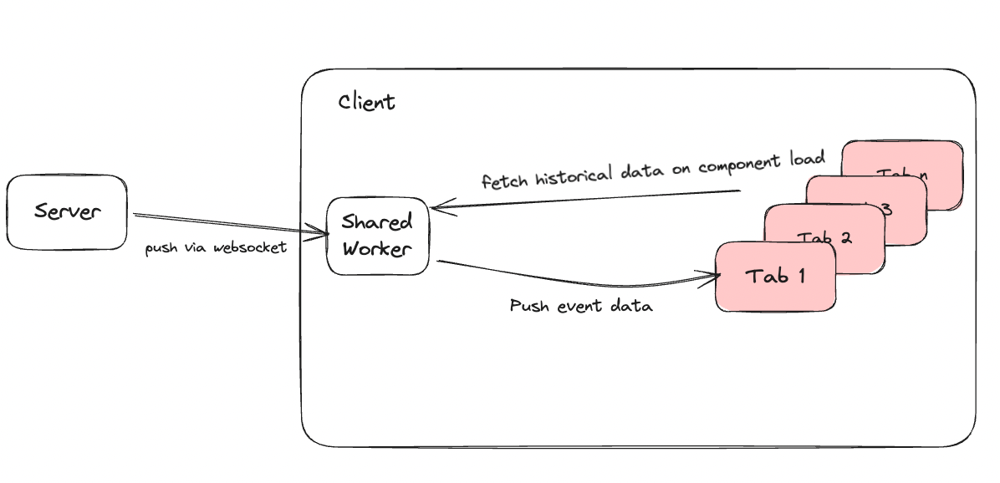
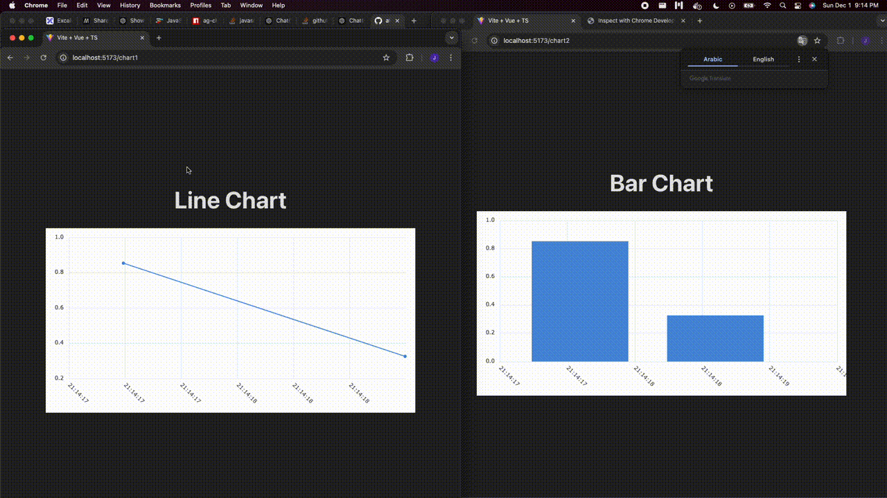

# Shared Worker Demo

The [Shared Worker](https://developer.mozilla.org/en-US/docs/Web/API/SharedWorker) interface creates a background worker in the browser that is accessible to any tab or window in the same browser, so long as it shares the same protocol, host, and port. The two-way communication between worker and window can enable cross-tab communication, or delegate heavy computations to a background thread.


Another interesting use use case for shared workers is to synchronize data between browser tabs. This repo demonstrates how a shared worker maintains a websocket connection with a server and broadcasts events to all connected browser tabs. The result is that each tab can be synchronized in real time with the same data.

## Diagram


## Demo Gif


## Usage 

Server Set Up

```
cd server
python -m venv venv
source ./venv/bin/activate
pip install -r requirements.txt
```

Client Set Up:
```
cd client
npm i
npm run dev
```